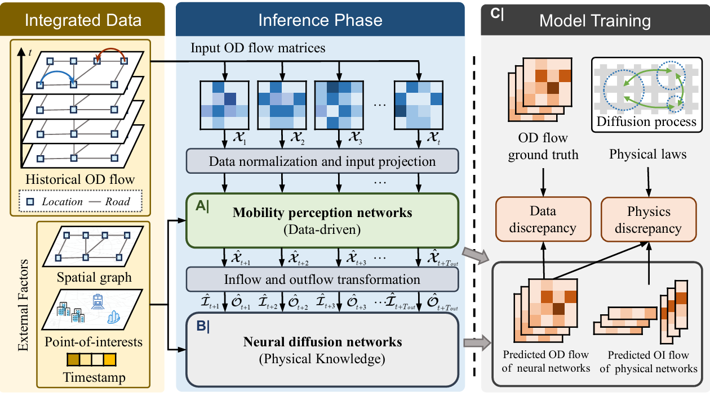

# PI-MPN  
  
This is a PyTorch implementation of **Physics-Informed Mobility Perception Networks for Origin-Destination Flow Prediction and Human Mobility Interpretation**.  
  
 

<p style="text-align: center;"><strong>Figure 1.</strong> Overall architecture of PI-MPN.</p>

## Get Started  
  
To get started with the PI-MPN project, follow these steps:  
  
1. **Install Required Dependencies**    
   Install Python 3.8 and the following Python packages:  
   - torch 2.2.0  
   - torchdiffeq 0.2.4  
   - numpy 1.26.0  
   - pandas 2.2.0 
2. Download and Prepare the Dataset. Download the dataset from [Google Drive](https://drive.google.com/drive/folders/10WVc7cdpt5082-fX-VVxpu53BqdjuosZ?usp=drive_link) and extract it to the ```dataset``` folder in the root directory of this project. 
3. Train the model. We have provided experiment scripts in the ```scripts/XC_script``` folder. You can effortlessly reproduce the experiment results.

```
bash ./scripts/XC_script/PI-MPN.sh
```

## Additional Notes
* Environment Compatibility
Always check the compatibility of the provided packages with your Python environment. You may need to adjust the package versions to suit your specific needs.
* Script Execution
If you encounter any issues while running the script, check the script's contents for any specific environment requirements or paths that may need to be adjusted.
* Data Privacy and Handling
Ensure you comply with any data privacy regulations or guidelines when handling the downloaded dataset.
